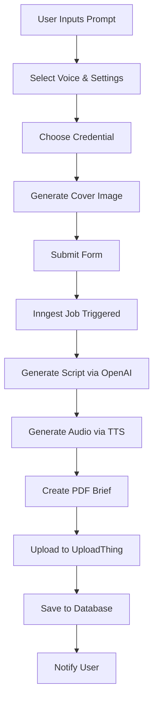
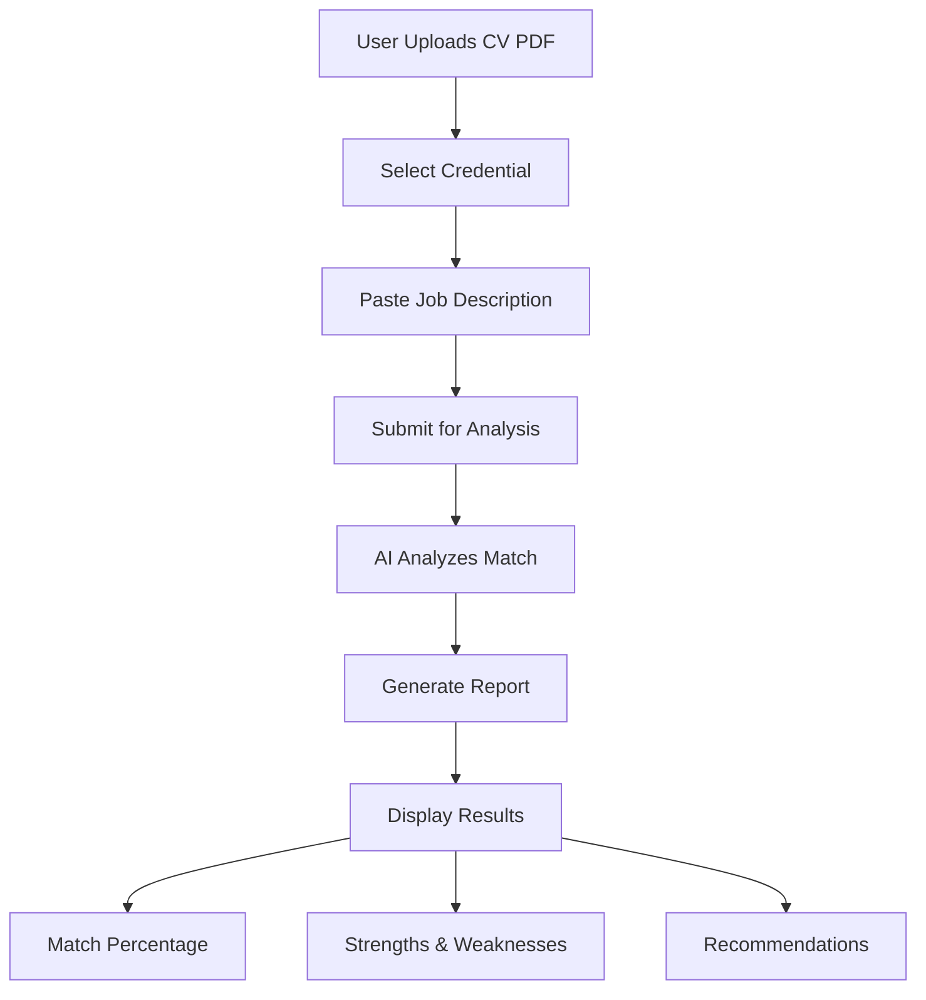

# 🚀 CareerCastAI

> **A Next.js 15 platform offering two powerful AI-powered services: Podcast Generator and CV Reviewer. Create professional podcasts or get AI-powered CV analysis to match with job descriptions.**

---

## 📋 Project Overview

CareerCastAI is a comprehensive web platform that provides two distinct AI-powered services:

### 🎙️ Service 1: Podcast Generator
Transform simple prompts into professional podcast episodes. The platform generates realistic debate-style podcasts between two AI voices, creates accompanying PDF briefs, and manages the entire workflow from prompt to publication.

### 📄 Service 2: CV Reviewer
Upload your CV and job description to get AI-powered analysis. The system evaluates your CV against job requirements, provides match percentage, identifies strengths and weaknesses, and offers actionable recommendations to improve your job application.

### Key Value Propositions

**Podcast Generator:**
- 🤖 **AI-Powered Content Generation**: Transform simple prompts into full podcast episodes
- 🎤 **Multiple Voice Options**: Choose from various AI voices for realistic conversations
- 📄 **Automatic PDF Generation**: Get detailed briefs and summaries automatically
- 🎨 **Image Generation**: AI-generated cover images using DALL-E

**CV Reviewer:**
- 📊 **AI-Powered Analysis**: Analyzes CVs against job descriptions
- 🎯 **Match Scoring**: Provides percentage match and detailed feedback
- 💪 **Strengths & Weaknesses**: Identifies key qualifications and improvement areas
- 📝 **Actionable Recommendations**: Suggests specific improvements

**Platform:**
- 🔐 **Secure & Scalable**: Enterprise-grade authentication and subscription management
- 🎨 **Modern UI/UX**: Beautiful, responsive interface with dark mode support

---

## 🏗️ Architecture

### Tech Stack

**Frontend:**
- Next.js 15 (App Router)
- React 19
- TypeScript
- Tailwind CSS v4
- Radix UI Components
- TanStack Query v5
- Framer Motion

**Backend:**
- Next.js API Routes
- tRPC v11 (Type-safe APIs)
- Prisma ORM
- PostgreSQL
- Better Auth
- Inngest (Background Jobs)

**Services & Integrations:**
- OpenAI (GPT-4, TTS, DALL-E)
- UploadThing (File Storage)
- Polar (Subscription Management)
- Sentry (Error Tracking)
- Upstash (Rate Limiting)

**Development Tools:**
- ESLint
- TypeScript (Strict Mode)
- Prisma Migrations

---

## 📁 Project Structure

```
careercast-ai/
├── app/                      # Next.js App Router
│   ├── (auth)/              # Authentication routes
│   ├── (community)/         # Community features
│   ├── api/                 # API endpoints
│   ├── podcast/             # Podcast routes
│   └── reviewer/            # CV Reviewer feature
├── components/              # React components
│   ├── ui/                  # Reusable UI components
│   ├── podcast-form/        # Podcast creation forms
│   ├── cv-reviwer/          # CV review components
│   └── ...
├── actions/                 # Server actions (AI logic)
├── trpc/                    # tRPC setup & routers
├── utils/                   # Utility functions
├── lib/                     # Shared libraries
├── prisma/                  # Database schema
└── public/                  # Static assets
```

---

## 🚀 Core Features

### 🎙️ Service 1: Podcast Generator

#### 1. AI Podcast Generation
- **Text Generation**: Converts user prompts into structured debate scripts
- **Voice Synthesis**: Generates realistic audio using OpenAI TTS
- **Multiple Models**: Support for different GPT and TTS models
- **Customizable Duration**: 1, 5, 10, or 20-minute podcasts
- **Voice Speed Control**: Adjustable playback speed

### 2. Image Generation
- **AI-Generated Covers**: Create podcast cover images using DALL-E
- **Model Selection**: Choose between DALL-E 2 and DALL-E 3
- **Automatic Upload**: Images automatically uploaded to UploadThing

### 3. PDF Brief Generation
- **Automatic Summaries**: Generates comprehensive episode summaries
- **Key Points Extraction**: Identifies main discussion points
- **Professional Formatting**: Clean, readable PDF layouts

### 📄 Service 2: CV Reviewer

#### 4. CV Analysis & Review
- **AI-Powered Analysis**: Analyzes CVs against job descriptions
- **Match Percentage**: Provides overall compatibility score (0-100%)
- **Match Verdict**: Boolean indicating if candidate is a good fit
- **Skills Matching**: Identifies matched and missing skills
- **Strengths & Weaknesses**: Detailed analysis with evidence
- **Recommendations**: Actionable improvements for better job fit
- **Experience Assessment**: Compares required vs. actual experience
- **Key Highlights**: Standout achievements from CV

### 🔧 Platform Features

#### 5. User Management
- **Authentication**: Secure login/signup with Better Auth
- **Profile Management**: Edit name, image, and preferences
- **Credential Management**: Store and manage OpenAI API keys securely
- **Subscription Tiers**: Free and Pro plans with Polar integration

#### 6. Admin Dashboard
- **User Management**: View and manage all users
- **Analytics**: Track users, podcasts, and subscriptions
- **Content Moderation**: Manage public/private podcast status

---

## 🔄 Key Workflows

### 🎙️ Podcast Generator Flow



### 📄 CV Reviewer Flow



### Authentication Flow

1. User signs up/logs in via Better Auth
2. Session created and stored
3. Protected routes check authentication
4. Subscription status verified for premium features
5. User credentials encrypted and stored

### Subscription Management

**Free Tier:**
- Podcast Generator: 3 trial podcasts
- CV Reviewer: Not available

**Pro Tier:**
- Podcast Generator: Unlimited podcasts
- CV Reviewer: Unlimited CV reviews
- Image Generation: Access to DALL-E
- Priority Support: Faster processing

- **Polar Integration**: Handles payments and webhooks
- **Automatic Updates**: Subscription status synced in real-time

---

## 🗄️ Database Schema

### Core Models

**User**
- Profile information
- Subscription status
- Trial usage tracking
- Relationships to podcasts and credentials

**Podcast**
- Generated content (script, audio, PDF)
- Metadata (title, duration, status)
- User association
- Public/Private visibility

**Credential**
- Encrypted API keys
- User association
- Named credentials for easy selection

**CVReviewer**
- Review results (JSON)
- User association
- Timestamps

---

## 🔐 Security Features

- ✅ **Authentication**: Better Auth with secure sessions
- ✅ **Authorization**: Role-based access control (USER, ADMIN)
- ✅ **Input Validation**: Zod schemas for all inputs
- ✅ **Rate Limiting**: Upstash Redis-based rate limiting
- ✅ **Credential Encryption**: Cryptr for API key storage
- ✅ **Protected Routes**: Middleware-based route protection
- ✅ **CSRF Protection**: Built into Next.js
- ✅ **Error Tracking**: Sentry for production monitoring

---

## 🎨 UI/UX Features

- **Dark Mode**: Full dark mode support with theme toggle
- **Responsive Design**: Mobile-first approach
- **Loading States**: Skeleton loaders and spinners
- **Toast Notifications**: User feedback via Sonner
- **Form Validation**: Real-time validation with helpful errors
- **Accessibility**: Radix UI components with ARIA support
- **Animations**: Smooth transitions with Framer Motion

---

## 📊 Performance Optimizations

- **Code Splitting**: Automatic with Next.js App Router
- **Image Optimization**: Next.js Image component
- **Data Fetching**: React Query for caching and deduplication
- **Background Jobs**: Inngest for async processing
- **Rate Limiting**: Prevents abuse and ensures fair usage

---

## 🧪 Development Setup

### Prerequisites
- Node.js 20+
- PostgreSQL database
- OpenAI API key
- UploadThing account
- Polar account (for subscriptions)

### Installation

```bash
# Clone repository
git clone <repository-url>
cd uploadthing-audio

# Install dependencies
npm install

# Set up environment variables
cp .env.example .env
# Fill in required values

# Run database migrations
npx prisma migrate dev

# Start development server
npm run dev
```

### Environment Variables

```env
# Database
DATABASE_URL="postgresql://..."

# Authentication
AUTH_SECRET="..."
AUTH_URL="http://localhost:3000"

# OpenAI
OPENAI_API_KEY="..."

# UploadThing
UPLOADTHING_SECRET="..."
UPLOADTHING_APP_ID="..."

# Polar (Subscriptions)
POLAR_ACCESS_TOKEN="..."
POLAR_WEBHOOK_SECRET="..."

# Sentry (Optional)
SENTRY_DSN="..."
```

---

## 🚢 Deployment

### Build Process

```bash
npm run build
npm start
```

### Production Considerations

- Set up PostgreSQL database (recommended: managed service)
- Configure environment variables
- Set up Sentry for error tracking
- Configure CDN for static assets
- Set up monitoring and alerts
- Enable rate limiting
- Configure backup strategy

---

## 📈 Future Enhancements

### Planned Features
- [ ] Podcast editing capabilities
- [ ] Social sharing improvements
- [ ] Analytics dashboard for users
- [ ] Export to various formats
- [ ] Multi-language support
- [ ] Voice cloning
- [ ] Collaborative features

### Technical Improvements
- [ ] Comprehensive test coverage
- [ ] Performance optimizations
- [ ] Enhanced accessibility
- [ ] Better error handling
- [ ] API documentation
- [ ] Monitoring and analytics

---

## 🤝 Contributing

This is a private project. For questions or suggestions, please contact the development team.

---

## 📄 License

Proprietary - All rights reserved

---

## 📞 Support

For support, please contact the development team or create an issue in the repository.

---

**Last Updated**: 2025
**Version**: 0.1.0
**Status**: Active Development

